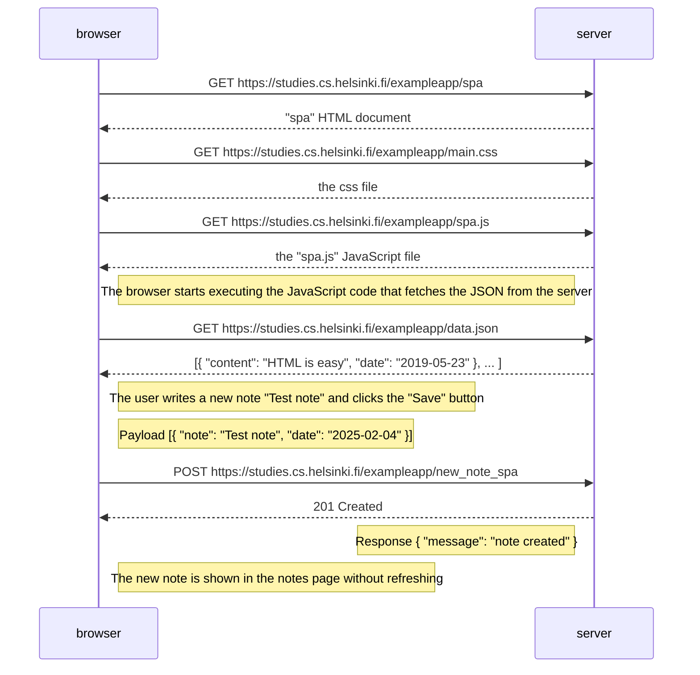

```mermaid
sequenceDiagram
    participant browser
    participant server

    browser->>server: GET https://studies.cs.helsinki.fi/exampleapp/spa
    server-->>browser: "spa" HTML document

    browser->>server: GET https://studies.cs.helsinki.fi/exampleapp/main.css
    server-->>browser: the css file

    browser->>server: GET https://studies.cs.helsinki.fi/exampleapp/spa.js
    server-->>browser: the "spa.js" JavaScript file

    Note right of browser: The browser starts executing the JavaScript code that fetches the JSON from the server

    browser->>server: GET https://studies.cs.helsinki.fi/exampleapp/data.json
    server-->>browser: [{ "content": "HTML is easy", "date": "2019-05-23" }, ... ]

    Note right of browser: The user writes a new note "Test note" and clicks the "Save" button

    Note right of browser: Payload [{ "note": "Test note", "date": "2025-02-04" }]
    browser->>server: POST https://studies.cs.helsinki.fi/exampleapp/new_note_spa
    server-->>browser: 201 Created
    Note left of server: Response { "message": "note created" }
    Note right of browser: The new note is shown in the notes page without refreshing
```